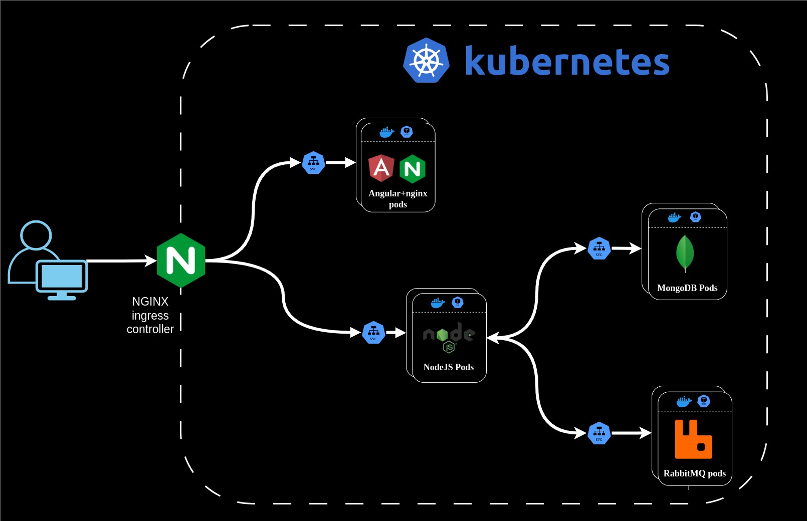

# Pip

A social chatting app where you can add your friends and loved ones and chat with them

## Demo

- **DISCLAIMER: PREFERRED TO BE ON PC**
- **DISCLAIMER: Might be down sometimes, since it's deployed on Azure AKS**

- [LIVE DEMO](http://www.pip-app.xyz)
- [ALTERNATE LINK](http://172.213.196.241)


## Tools used

-   ExpressJS and NodeJS
-   Angular
-   tailwind
-   Socket.io
-   RabbitMQ
-   MongoDB
-   Nginx

## Features

-   Creating your own account
-   Changing your username and profile picture that your friends see
-   Ability to search for other users and send them friend requests
-   Manuiplation of friend requests such as accepting or rejecting
-   Ability to send and receive **REALTIME** messages from other users
-   Changes to friends and friends requests are also all delivered in **REALTIME**

## Challenges faced 
1. Since we are using a containerized environment, there will be multiple backend container running on multiple servers. Therefore, every user socket connection won't be to a one single server.
    - **Solution**: Every backend pod keeps track of its socket connections. When we want to deliver a realtime change, we send to rabbitMQ, rabbitMQ will then broadcast to all backend pods. Each backend checks if any user connected to them should recieve any changes
2. How to store all chat messages without overflowing the database?
    - **Solution**: We have a chat model and a message model. The chat has a list of messages. However, the list of messages only store the objectId of the messages. referencing to the specific message in the messages collection.
3. How to store user's friends, friend requests without overflowing the database?
    - **Solution**: We used a similar solution to #2

## Architecture



## Installation by docker

1.   **Download the docker compose file**

2.  **Run docker compose file**

```bash
docker compose up
```

3. **Go to localhost:80 to test**

## Installation locally

#### - Make sure you have rabbitMQ and mongoDB already installed and running on their respective default ports

1.   **install node**

```bash
# installs nvm (Node Version Manager)
curl -o- https://raw.githubusercontent.com/nvm-sh/nvm/v0.39.7/install.sh | bash

# download and install Node.js (you may need to restart the terminal)
nvm install 20

# verifies the right Node.js version is in the environment
node -v # should print `v20.15.0`

# verifies the right NPM version is in the environment
npm -v # should print `10.7.0`
```

2.   **install angluar cli**

```bash
npm install @angluar/cli
```

3.   **clone project**

```bash
git clone https://github.com/osamagharib44/pip
```

4.   **setup the frontend**

```bash
cd frontend
npm install
ng serve
```

5.   **setup the backend**

```bash
cd backend
npm install
npm start
```

6. **go to localhost:4200 to test**
